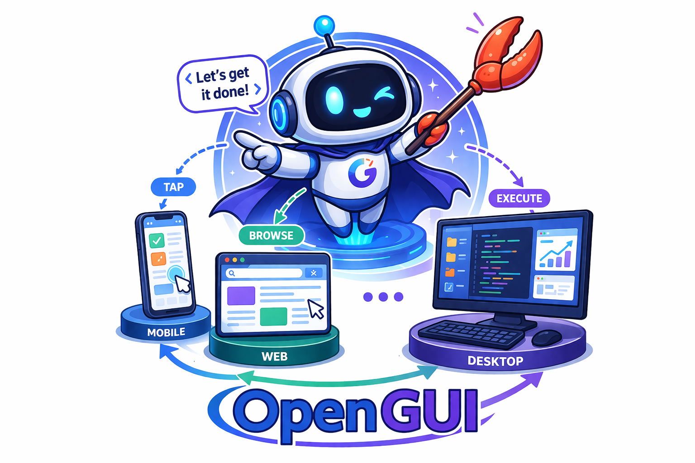
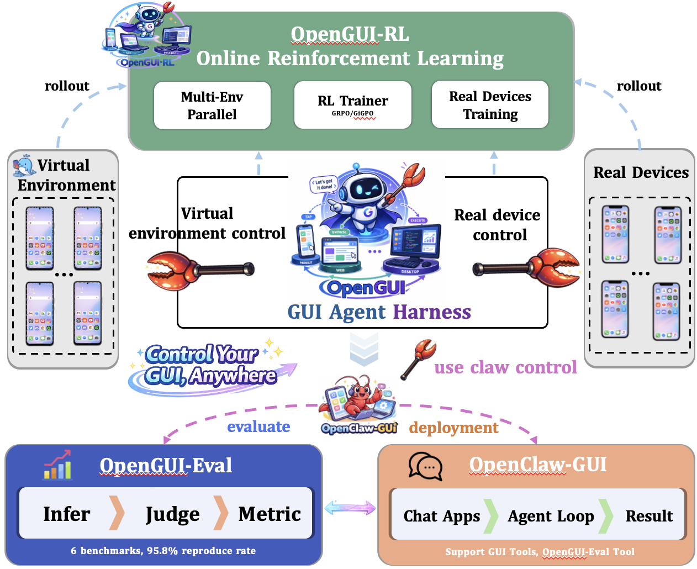

<div align="center">

<h1>
  
  OpenGUI: A Unified GUI Agent Harness
</h1>

[](https://www.python.org/downloads/release/python-3120/)
[](https://opensource.org/licenses/Apache-2.0)
[](https://github.com/sugarandgugu/OpenGUI/stargazers)
[](https://huggingface.co/)
[](https://modelscope.cn/)

[English](README.md) | [中文](README_zh.md)

</div>

---

## 📚 Table of Contents

- [Overview](#-overview)
- [Architecture](#️-architecture)
- [Quick Start](#-quick-start)
  - [OpenClaw-GUI — Agent Inference](#-openclaw-gui--agent-inference)
  - [OpenGUI-Eval — Evaluation](#-opengui-eval--evaluation)
  - [OpenGUI-RL — Online RL Training](#-opengui-rl--online-rl-training)
- [Acknowledgements](#-acknowledgements)

---

## 📖 Overview

**OpenGUI** is a full-stack, end-to-end agent harness system for GUI intelligence. It covers the complete lifecycle of a GUI agent — from **inference and deployment**, through **standardized evaluation**, to **online reinforcement learning training** — providing researchers and engineers with a unified, production-ready infrastructure.

| Module | Description |
|--------|-------------|
| 🤖 **[OpenClaw-GUI](openclaw-gui/)** | GUI agent inference framework — control mobile devices via natural language through Feishu, DingTalk, Telegram and 12+ chat platforms, powered by VLMs and a personalized memory system |
| 📊 **[OpenGUI-Eval](opengui-eval/)** | Standardized GUI grounding evaluation suite — 6 benchmarks, 11+ models, 95%+ faithful reproduction of official results |
| 🚀 **[OpenGUI-RL](opengui-rl/)** | Scalable online RL training infrastructure — parallel multi-environment training, real-device support, GiGPO with PRM, robust spare-server rotation |
| 🏆 **OpenGUI-2B** | State-of-the-art 2B GUI agent trained with GiGPO, achieving **17.1** MobileWorld SR |

---

## 🏗️ Architecture

<div align="center">

</div>

---

## 🚀 Quick Start

First, clone the repository:

```bash
git clone https://github.com/sugarandgugu/OpenGUI.git
cd OpenGUI
```

OpenGUI consists of three independent modules. Follow the guide for whichever you need.

---

### 🤖 OpenClaw-GUI — Agent Inference

> [`openclaw-gui/`](openclaw-gui/)

OpenClaw-GUI lets you control Android / HarmonyOS / iOS devices with natural language by sending messages through popular chat platforms (Feishu, DingTalk, Telegram, Discord, Slack, QQ, and more). It is built on [OpenClaw](https://github.com/openclaw/openclaw) and [nanobot](https://github.com/HKUDS/nanobot), supporting AutoGLM, MAI-UI, GUI-Owl, Qwen-VL, and UI-TARS via OpenAI-compatible APIs. A built-in personalized memory system automatically learns your preferences and improves over time. Every task execution is recorded as a structured episode for replay and dataset building. A Gradio Web UI is also provided for interactive use.

```bash
cd openclaw-gui

uv venv .venv && source .venv/bin/activate
uv pip install -e .
uv pip install -e nanobot/

# Initialize configuration
nanobot onboard

# Start via chat platform gateway
nanobot gateway

# Or launch the Web UI
python webui.py
```

> For device connection (ADB / HDC / iOS) and chat platform setup, see [`openclaw-gui/README.md`](openclaw-gui/README.md).

---

### 📊 OpenGUI-Eval — Evaluation

> [`opengui-eval/`](opengui-eval/) | [🤗 HuggingFace Dataset](https://huggingface.co/datasets/johnzqlu/opengui-eval) | [🤖 ModelScope](https://modelscope.cn/datasets/Matrix0602/opengui-eval)

OpenGUI-Eval is a standardized evaluation framework for GUI grounding models. It adopts a three-stage **Infer → Judge → Metric** pipeline and covers 6 benchmarks (ScreenSpot-Pro, ScreenSpot-V2, UIVision, MMBench-GUI, OSWorld-G, AndroidControl) with 11+ supported models including Qwen3-VL, Qwen2.5-VL, UI-TARS, MAI-UI, GUI-G2, UI-Venus, Gemini, and Seed 1.8. Both local GPU (transformers) and remote API backends are supported, with multi-GPU parallel inference and automatic resume. Reproduction rate against official numbers: **95.8%**.

```bash
cd opengui-eval

conda create -n opengui-eval python=3.12 -y
conda activate opengui-eval
pip install -r requirements.txt
pip install flash-attn==2.8.1 --no-build-isolation

# Download benchmark data
huggingface-cli download johnzqlu/opengui-eval --repo-type dataset --local-dir .

# Run inference → judge → metric
bash scripts/infer/transformers/qwen3vl_run_transformers.sh
bash scripts/judge/screenspot-pro_run_judge.sh
bash scripts/metric/run_metric_screenspot_pro.sh
```

> For full benchmark coverage, model support, and parameter details, see [`opengui-eval/README.md`](opengui-eval/README.md).

---

### 🚀 OpenGUI-RL — Online RL Training

> [`opengui-rl/`](opengui-rl/)

OpenGUI-RL is a scalable online RL infrastructure for GUI agent training. It supports parallel training across dozens of virtual Android environments (via Docker-based MobileWorld), as well as real-device training on physical or cloud phones. Out-of-the-box support for MAI-UI and GUI-Owl, extensible to the Qwen3-VL family. Includes the GiGPO algorithm with PRM for fine-grained step-level reward, spare-server rotation for automatic failover, periodic environment restart for stability, and episode trajectory recording and visualization.

```bash
cd opengui-rl

conda create -n opengui-rl python=3.12 -y
conda activate opengui-rl
pip3 install vllm==0.11.0
pip3 install flash-attn==2.7.4.post1 --no-build-isolation --no-cache-dir
pip install -e .
pip install swanlab

# Set up OpenGUI-Server (virtual environments)
# git clone https://github.com/sugarandgugu/OpenGUI-Server.git
# Fill in examples/env_server/mobileworld_server.txt with container URLs

# Download geometry3k dataset
huggingface-cli download hiyouga/geometry3k --repo-type dataset --local-dir ~/data/geometry3k

# Launch training (GRPO)
bash examples/grpo_trainer/run_mobileworld.sh

# Or GiGPO (recommended, uses PRM for better results)
bash examples/gigpo_trainer/run_mobileworld.sh
```

> For real-device training, parameter details, and model conversion to HuggingFace format, see [`opengui-rl/README.md`](opengui-rl/README.md).

---

## 🙏 Acknowledgements

OpenGUI is built upon the following excellent open-source projects. We sincerely thank their contributors:

- [**verl-agent**](https://github.com/langfengq/verl-agent) — The underlying RL training engine
- [**MAI-UI**](https://github.com/Tongyi-MAI/MAI-UI) — GUI-Spec model and GUI action framework
- [**MobileWorld**](https://github.com/Tongyi-MAI/MobileWorld) — Android emulator environment
- [**Mobile-Agent**](https://github.com/x-plug/mobileagent) — Mobile agent research and infrastructure
- [**nanobot**](https://github.com/HKUDS/nanobot) — Personal AI assistant and multi-platform gateway
- [**Open-AutoGLM**](https://github.com/zai-org/Open-AutoGLM) — GUI agent framework for mobile automation

---

## 📄 License

This project is licensed under the [Apache License 2.0](LICENSE).
